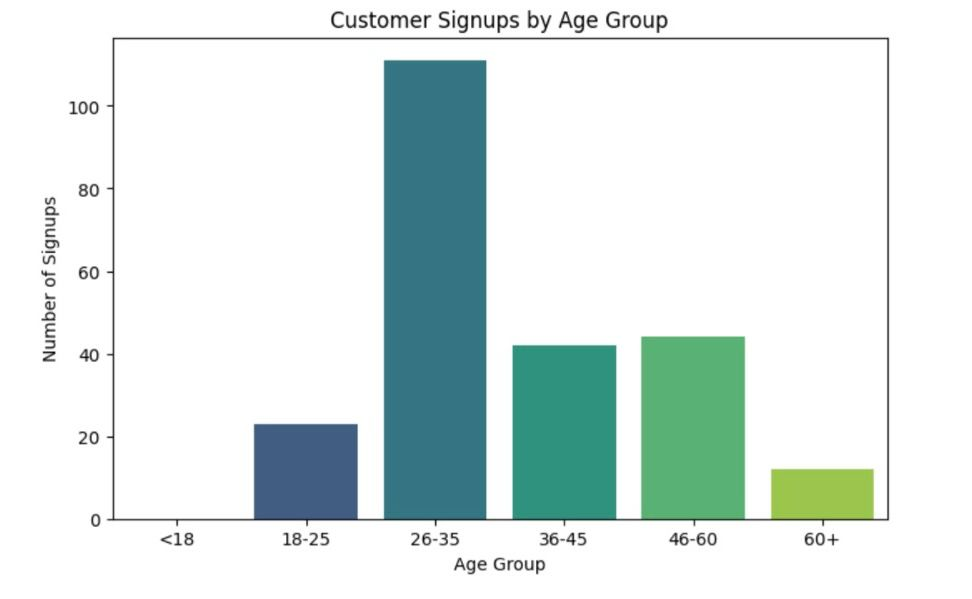
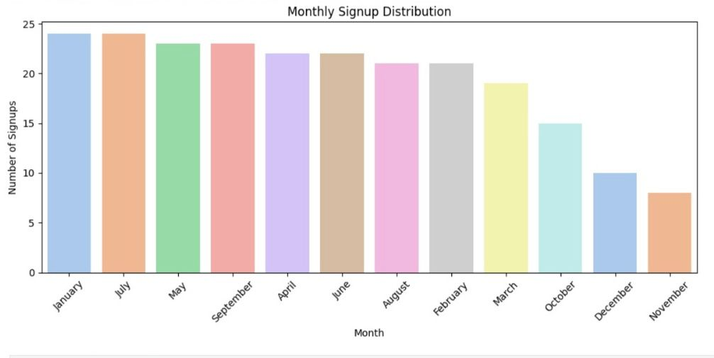
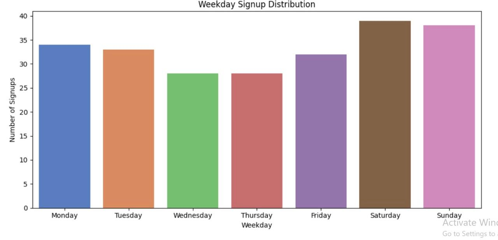
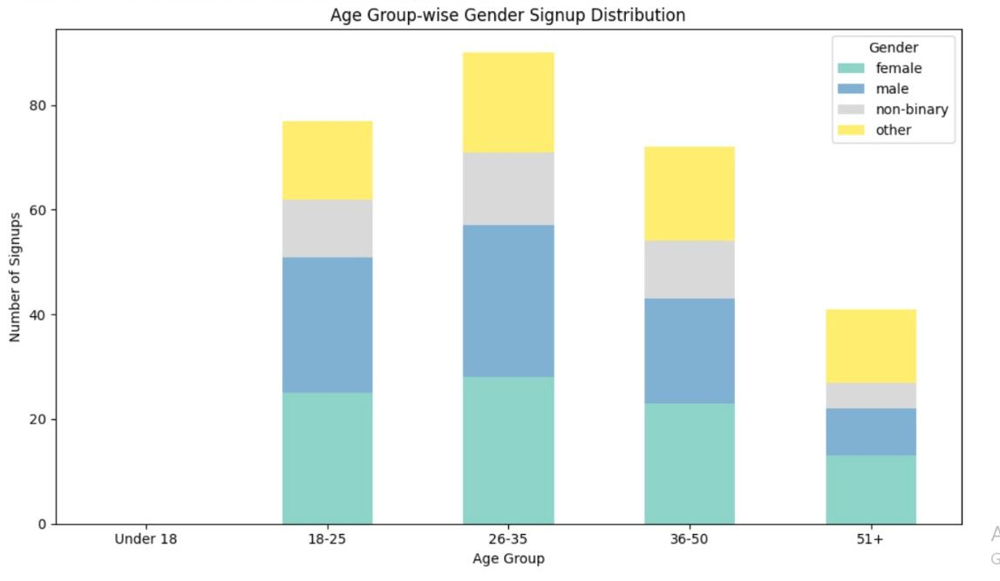
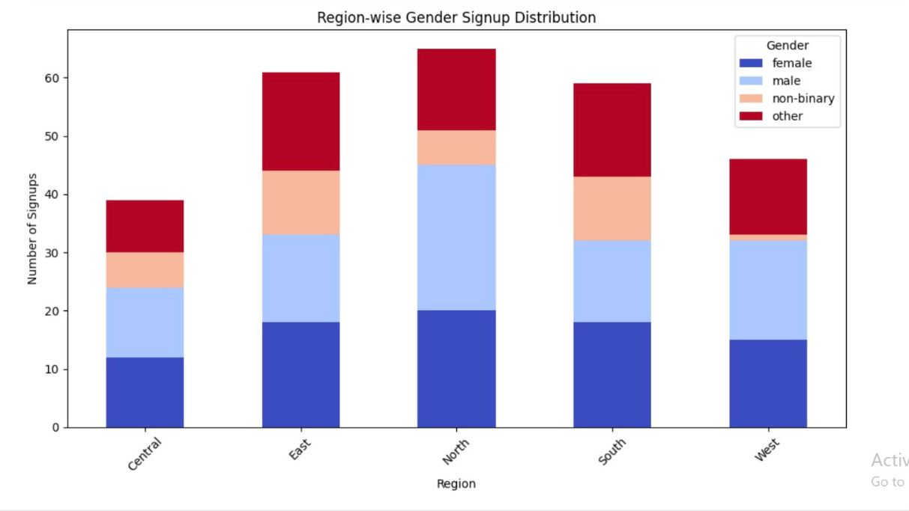
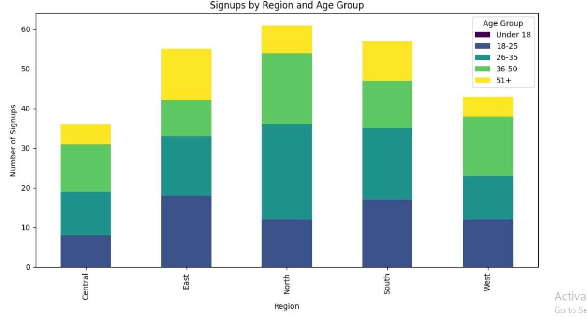

## Customer_SignUp_Behaviour_Data_Audit_NovaTech_Solution_Ltd

## Project Objectives
This project analyzes customer sign-up behaviour and evaluates data quality issues in the `customer_signups.csv` dataset for **NovaTech Solutions Ltd.** The goal was to understand customer sign-up patterns across regions, age groups, genders, and time periods, while also auditing data quality.

## Objectives
- Identify **trends in customer sign-ups**
- Examine sign-ups across **regions, genders, and age groups**
- Assess **data quality issues**
- Provide **business recommendations**

## Project Files
- [Raw Data](customer_signups.csv)
- [Jupter Notebook](Customer_SignUp_Behaviour_Data_Audit.ipynb)
- [Business Report](./NovaTech_Solutions_Customer_SignUp_Data_Audit.pdf)

## Tools & Libraries
- Python
- Pandas
- Matplotlib & Seaborn
- Jupyter Notebook

## Type of Analysis
- **Exploratory Data Analysis (EDA)** – uncovering demographic, regional, and temporal trends
- **Data Quality Audit** – checking missing values, duplicates, and inconsistencies

## Key Visuals
# Customer signups by age (barplot) 

# Monthly signup distribution (barplot)

# Weekday signup distribution (barplot)  

# Age group-wise gender signup distribution (stacked barplot)

# Region-wise gender signup distribution (stacked barplot)

# Signups by region and age group (stacked barplot) 

##  Key Insights
- Younger customers dominate sign-ups  
- West & South regions lead in adoption  
- Sign-ups peak **Fridays/weekends**  
- Gender dynamics vary by age group and region  

##  Recommendations
- Focus marketing on **younger demographics**  
- Run **timed campaigns** (Fridays/weekends)  
- Expand adoption in the **East region**  
- Apply **gender-aware targeting**  
- Improve **data entry validation**  

## How to run
-  Open `Customer_SignUp_Behaviour_Data_Audit.ipynb`on Github or locally in Jupyter. The notebook documents cleaning, EDA, Data quality audit, and evaluation.
